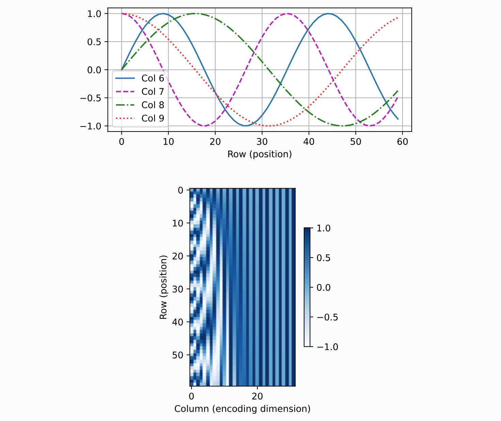

# Transformer核心模块详解

## 前言

本文档通过vit项目，详细解析Transformer的五个核心模块：Positional Embedding、Multi-Head Attention、MLP、LayerNorm和Classification。通过分析代码实现，深入理解每个模块的工作原理和设计思想。

## Transformer
### 源码实现

```python
class ViT(nn.Module):

    def __init__(
        self,
        image_size: int = 224,
        in_channels: int = 3,
        patch_size: int = 16,
        num_transformer_layers: int = 12,
        embedding_dim: int = 768,
        mlp_size: int = 3072,
        num_heads: int = 12,
        attn_dropout: float = 0,
        mlp_dropout: float = 0.1,
        embedding_dropout: float = 0.1,
        num_classes: int = 1000,
    ) -> None:
        super().__init__()

        assert image_size % patch_size ==0

        # embedding
        self.num_patches = (image_size * image_size) // (patch_size**2)
        self.class_embedding = nn.Parameter(
            data=torch.randn(1, 1, embedding_dim), requires_grad=True
        )
        self.position_embedding = nn.Parameter(
            data=torch.randn(1, self.num_patches + 1, embedding_dim), requires_grad=True
        )
        self.embedding_dropout = nn.Dropout(p=embedding_dropout)
        self.patch_embedding = PatchEmbedding(
            in_channels=in_channels, patch_size=patch_size, embedding_dim=embedding_dim
        )

        # transformer decoder
        self.transformer_encoder = nn.Sequential(
            *[
                TransformerEncoderBlock(
                    embedding_dim=embedding_dim,
                    num_heads=num_heads,
                    mlp_size=patch_size,
                    mlp_dropout=mlp_dropout,
                    attn_drop_out=attn_dropout
                )
                for _ in range(num_transformer_layers)
            ]
        )

        # classifier
        self.classifier = nn.Sequential(
            nn.LayerNorm(normalized_shape=embedding_dim),
            nn.Linear(in_features=embedding_dim, out_features=num_classes),
        )

    def forward(self,x):
        batch_size = x.shape[0]
        class_token = self.class_embedding.expand(batch_size, -1, -1)
        x_patched= self.patch_embedding(x)
        x_patched = torch.cat((class_token, x_patched), dim=1)
        x = self.position_embedding + x_patched
        x = self.embedding_dropout(x)

        x = self.transformer_encoder(x)

        x = self.classifier(x[:,0])
        return x
```


## Positional Embedding（位置嵌入）

### 源码实现

在ViT项目中，位置嵌入的实现如下：

```python
class PositionalEncoding(nn.Module):
    """位置编码"""
    def __init__(self, num_hiddens, dropout, max_len=1000):
        super(PositionalEncoding, self).__init__()
        self.dropout = nn.Dropout(dropout)
        # 创建一个足够长的P
        self.P = torch.zeros((1, max_len, num_hiddens))
        X = torch.arange(max_len, dtype=torch.float32).reshape(
            -1, 1) / torch.pow(10000, torch.arange(
            0, num_hiddens, 2, dtype=torch.float32) / num_hiddens)
        self.P[:, :, 0::2] = torch.sin(X)
        self.P[:, :, 1::2] = torch.cos(X)

    def forward(self, X):
        X = X + self.P[:, :X.shape[1], :].to(X.device)
        return self.dropout(X)
```

### 工作原理

位置编码的目的是为Transformer模型提供序列中每个位置的位置信息，因为Transformer本身是位置无关的。

$$
\begin{split}\begin{aligned} p_{i, 2j} &= \sin\left(\frac{i}{10000^{2j/d}}\right),\\p_{i, 2j+1} &= \cos\left(\frac{i}{10000^{2j/d}}\right).\end{aligned}\end{split}
$$


### LayerNorm
#### 源码实现
```python
class LayerNorm(nn.Module):
    """
    层归一化（Layer Normalization）

    对每个样本的特征进行归一化，与BatchNorm不同：
    - BatchNorm: 对batch中的同一个特征进行归一化
    - LayerNorm: 对单个样本的所有特征进行归一化
    """

    def __init__(self, num_features: int, eps: float = 1e-6):
        """
        初始化LayerNorm

        Args:
            num_features: 特征维度
            eps: 防止除零的小常数
        """
        super(LayerNorm, self).__init__()
        # 可学习的缩放参数
        self.gamma = nn.Parameter(torch.ones(num_features))
        # 可学习的偏移参数
        self.beta = nn.Parameter(torch.zeros(num_features))
        self.eps = eps

    def forward(self, X: torch.Tensor) -> torch.Tensor:
        """
        前向传播

        Args:
            X: 输入张量，形状: (batch_size, seq_len, num_features)

        Returns:
            归一化后的张量
        """
        # 计算均值和方差，沿着最后一个维度
        mean = X.mean(-1, keepdim=True)
        var = X.var(-1, unbiased=False, keepdim=True)

        # 归一化
        X_norm = (X - mean) / torch.sqrt(var + self.eps)

        # 缩放和偏移
        return self.gamma * X_norm + self.beta
```

#### 工作原理

LayerNorm对每个样本的所有特征进行归一化，使得特征的均值为0，方差为1。然后通过可学习的参数γ（缩放）和β（偏移）来恢复数据的表示能力。

**公式**：
```
LayerNorm(x) = γ * (x - μ) / sqrt(σ² + ε) + β
```

**优势**：
- 不依赖于batch大小，对小batch或单个样本也能正常工作
- 训练和推理时行为一致
- 对于RNN和Transformer等序列模型特别有效

### MultiHeadAttention
#### 源码实现
```python
class MultiHeadAttention(nn.Module):
    """
    多头注意力机制（Multi-Head Attention）

    多头注意力允许模型同时关注来自不同表示子空间的信息。
    每个注意力头学习输入序列的不同方面的表示。
    """

    def __init__(
        self,
        embed_dim: int,
        num_heads: int,
        dropout: float = 0.1,
        bias: bool = True
    ):
        """
        初始化多头注意力

        Args:
            embed_dim: 输入嵌入维度
            num_heads: 注意力头的数量
            dropout: dropout概率
            bias: 是否使用偏置
        """
        super(MultiHeadAttention, self).__init__()
        assert embed_dim % num_heads == 0, "embed_dim must be divisible by num_heads"

        self.embed_dim = embed_dim
        self.num_heads = num_heads
        self.head_dim = embed_dim // num_heads
        self.scale = self.head_dim ** -0.5  # 缩放因子，防止梯度消失

        # Q, K, V的线性变换
        self.q_proj = nn.Linear(embed_dim, embed_dim, bias=bias)
        self.k_proj = nn.Linear(embed_dim, embed_dim, bias=bias)
        self.v_proj = nn.Linear(embed_dim, embed_dim, bias=bias)

        # 输出投影
        self.out_proj = nn.Linear(embed_dim, embed_dim, bias=bias)

        # Dropout
        self.dropout = nn.Dropout(dropout)

    def forward(
        self,
        query: torch.Tensor,
        key: torch.Tensor,
        value: torch.Tensor,
        key_padding_mask: torch.Tensor = None,
        attn_mask: torch.Tensor = None,
        need_weights: bool = True
    ) -> tuple:
        """
        前向传播

        Args:
            query: 查询张量，形状: (batch_size, tgt_len, embed_dim)
            key: 键张量，形状: (batch_size, src_len, embed_dim)
            value: 值张量，形状: (batch_size, src_len, embed_dim)
            key_padding_mask: 键填充掩码
            attn_mask: 注意力掩码
            need_weights: 是否返回注意力权重

        Returns:
            注意力输出和注意力权重（如果need_weights=True）
        """
        batch_size, tgt_len, embed_dim = query.size()
        src_len = key.size(1)

        # 线性变换得到Q, K, V
        Q = self.q_proj(query)  # (batch_size, tgt_len, embed_dim)
        K = self.k_proj(key)    # (batch_size, src_len, embed_dim)
        V = self.v_proj(value)  # (batch_size, src_len, embed_dim)

        # 重塑为多头格式
        # (batch_size, seq_len, embed_dim) -> (batch_size, seq_len, num_heads, head_dim)
        Q = Q.view(batch_size, tgt_len, self.num_heads, self.head_dim)
        K = K.view(batch_size, src_len, self.num_heads, self.head_dim)
        V = V.view(batch_size, src_len, self.num_heads, self.head_dim)

        # 转置维度以支持批量矩阵乘法
        # (batch_size, seq_len, num_heads, head_dim) -> (batch_size, num_heads, seq_len, head_dim)
        Q = Q.transpose(1, 2)
        K = K.transpose(1, 2)
        V = V.transpose(1, 2)

        # 计算注意力分数
        # (batch_size, num_heads, tgt_len, head_dim) × (batch_size, num_heads, head_dim, src_len)
        # -> (batch_size, num_heads, tgt_len, src_len)
        attn_scores = torch.matmul(Q, K.transpose(-2, -1)) * self.scale

        # 应用掩码（如果提供）
        if attn_mask is not None:
            attn_scores = attn_scores.masked_fill(attn_mask == 0, float('-inf'))

        if key_padding_mask is not None:
            attn_scores = attn_scores.masked_fill(
                key_padding_mask.unsqueeze(1).unsqueeze(2),
                float('-inf')
            )

        # 计算注意力权重
        attn_weights = F.softmax(attn_scores, dim=-1)
        attn_weights = self.dropout(attn_weights)

        # 应用注意力权重到V
        # (batch_size, num_heads, tgt_len, src_len) × (batch_size, num_heads, src_len, head_dim)
        # -> (batch_size, num_heads, tgt_len, head_dim)
        attn_output = torch.matmul(attn_weights, V)

        # 重塑输出
        # (batch_size, num_heads, tgt_len, head_dim) -> (batch_size, tgt_len, embed_dim)
        attn_output = attn_output.transpose(1, 2).contiguous()
        attn_output = attn_output.view(batch_size, tgt_len, embed_dim)

        # 输出投影
        attn_output = self.out_proj(attn_output)

        if need_weights:
            # 返回平均后的注意力权重
            avg_attn_weights = attn_weights.mean(dim=1)
            return attn_output, avg_attn_weights
        else:
            return attn_output, None
```

#### 工作原理

多头注意力机制的核心思想是将输入投影到多个不同的子空间（多个头），在每个子空间中并行计算注意力，然后将所有头的输出拼接并投影回原始维度。

**核心公式**：
```
Attention(Q,K,V) = softmax(QK^T / sqrt(d_k))V
```

**工作流程**：
1. **线性投影**：将输入Q、K、V分别通过线性层投影到多个头
2. **注意力计算**：在每个头中计算缩放点积注意力
3. **拼接输出**：将所有头的输出拼接在一起
4. **最终投影**：通过线性层将拼接结果投影回原始维度

**优势**：
- 能够捕捉不同类型的依赖关系
- 增强模型的表达能力
- 并行计算提高效率
- 每个头可以学习不同的特征表示模式


## MLP（多层感知机）

### 源码实现

```python
class MLPBlock(nn.Module):
    def __init__(
        self, embedding_dim: int = 768, mlp_size: int = 3072, dropout: float = 0.1
    ) -> None:
        super().__init__()
        self.layer_norm = nn.LayerNorm(normalized_shape=embedding_dim)
        self.mlp = nn.Sequential(
            nn.Linear(in_features=embedding_dim, out_features=mlp_size),  # 768 → 3072
            nn.GELU(),                                                    # 激活函数
            nn.Dropout(p=dropout),                                        # 正则化
            nn.Linear(in_features=mlp_size, out_features=embedding_dim),  # 3072 → 768
            nn.Dropout(p=dropout)                                         # 正则化
        )

    def forward(self, x):
        x = self.layer_norm(x)  # 先归一化
        x = self.mlp(x)         # MLP变换
        return x
```

### 工作原理

MLP（多层感知机）在Transformer中作为每个位置的非线性变换模块，为模型提供强大的表达能力。

**结构组成**：
1. **LayerNorm**: 先对输入进行层归一化，稳定训练
2. **扩展层**: 将维度从 embedding_dim 扩展到 mlp_size（通常是4倍）
3. **激活函数**: 使用GELU激活函数，提供非线性变换
4. **收缩层**: 将维度从 mlp_size 收缩回 embedding_dim
5. **Dropout**: 在两个线性层后都添加Dropout进行正则化

**工作流程**：
```
输入 -> LayerNorm -> Linear(扩展) -> GELU -> Dropout -> Linear(收缩) -> Dropout -> 输出
```

**作用**：
- 提供非线性变换能力，增强模型的表达能力
- 与注意力机制互补，注意力负责信息聚合，MLP负责特征变换
- 通过扩展-收缩的结构增加模型的参数量和表达能力

**设计理念**：
- 维度扩展（通常是4倍）增加了模型的中间表示空间
- GELU激活函数相比ReLU更平滑，有助于梯度流动
- Dropout正则化防止过拟合

## Classification（分类模块）

### 源码实现

```python
class ViT(nn.Module):
    def __init__(self, embedding_dim: int = 768, num_classes: int = 1000):
        # 分类头设计
        self.classifier = nn.Sequential(
            nn.LayerNorm(normalized_shape=embedding_dim),
            nn.Linear(in_features=embedding_dim, out_features=num_classes),
        )

    def forward(self, x):
        # ... 前面的Transformer处理
        x = self.classifier(x[:, 0])  # 只使用CLS token进行分类
        return x
```

### 工作原理

分类模块是Vision Transformer的最后一环，负责将Transformer编码后的特征映射到最终的类别空间。

**设计特点**：
1. **CLS Token选择**: 只使用序列中的第一个token（CLS token）进行分类
   - CLS token在训练过程中学会聚合全局信息
   - 相比于对所有token取平均，CLS token能更好地捕获整体表示

2. **LayerNorm**: 对CLS token的表示进行归一化
   - 确保输入到分类层的特征分布稳定
   - 提高训练的稳定性和收敛速度

3. **线性分类器**: 将embedding_dim维的特征映射到num_classes维
   - 输出每个类别的logits
   - 在训练时配合CrossEntropyLoss使用

**工作流程**：
```
Transformer输出 -> 提取CLS token -> LayerNorm -> Linear分类 -> 输出logits
```

**为什么使用CLS Token**：
- **全局信息聚合**: CLS token通过自注意力机制与所有patch token交互，学习到全局表示
- **简洁高效**: 避免了复杂的池化操作
- **可解释性**: 可以直接分析CLS token的表示来理解模型的判断依据
- **迁移学习友好**: CLS token的表示可以作为通用的图像特征用于其他任务
