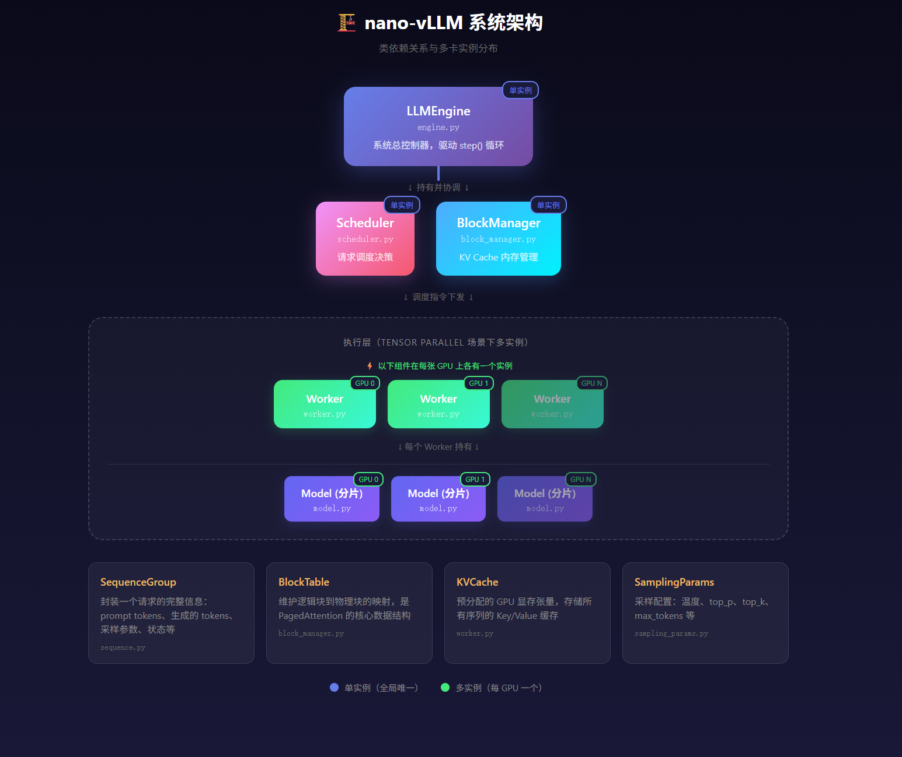
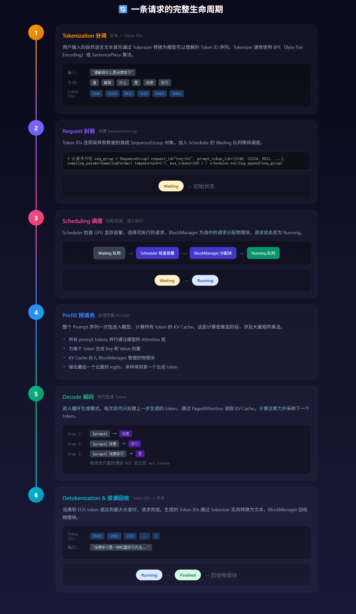
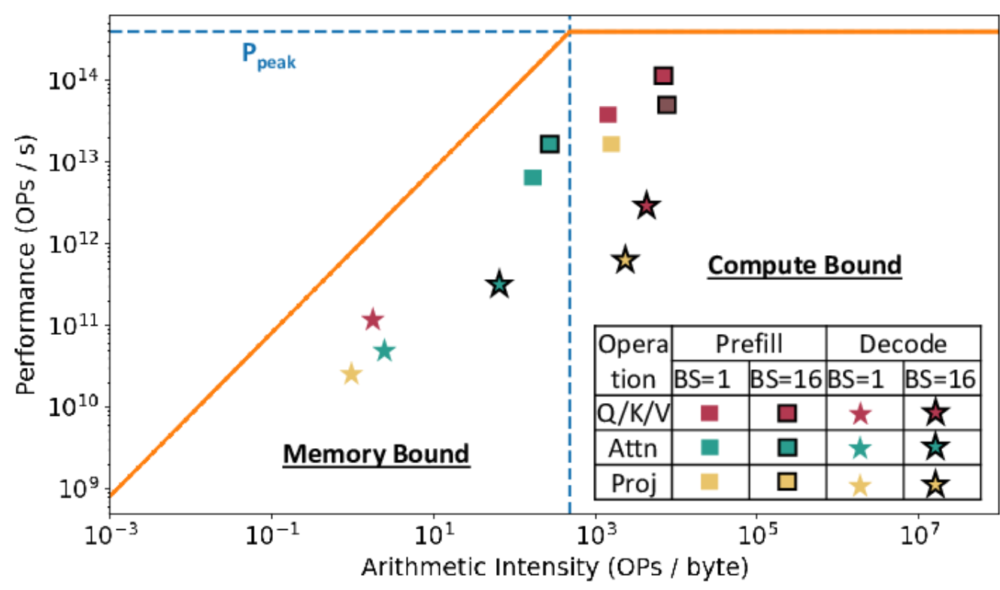

# 主题一：推理全流程串讲（概览篇）

## 1. 课程目标

- **理解 vLLM 的核心设计理念**：为什么要专门搞一个推理引擎，而不是直接拿 PyTorch 写个 generate 循环就完事？这背后涉及到传统方法遇到的实实在在的性能瓶颈，以及 vLLM 如何用一套受操作系统启发的设计来解决这些问题。

- **理清推理流程的全生命周期**：一个 prompt 进来之后，到底经历了哪些步骤才变成最终输出？我们会从头到尾追踪一条请求在系统里的完整旅程。

- **大致了解 vllm/nano-vllm 的核心架构**：nano-vllm 是一个轻量级的 vLLM 实现，用大约 1200 行 Python 代码实现了可读性很强的代码库，同时保持了与 vLLM 相当的推理速度。我们会了解它的核心模块划分以及各模块之间的协作关系。

---

## 2. 核心内容

### 一、vLLM 解决的核心痛点

如果你之前用过 Hugging Face Transformers 做推理，可能会发现一个尴尬的现象：GPU 显存占用很高，但实际利用率却时高时低，吞吐量也上不去。这不是你的代码有问题，而是传统推理方式本身就存在几个根本性的局限。

#### 1.1 传统推理的三大痛点


**痛点一：KV Cache 的显存碎片化**

在自回归解码过程中，每个 token 都会生成对应的 Key 和 Value 向量，这些缓存需要保存在 GPU 显存中。传统方法为每个请求分配一块连续的内存空间。

问题在于，当某些请求完成并释放内存后，会在显存中留下不连续的"空洞"。新来的请求如果需要比这些空洞更大的连续空间，就无法利用这些已释放的内存——这与早期操作系统面临的内存碎片化问题如出一辙。


**痛点二：静态批处理的低效**

传统的批处理方式是"静态"的：凑齐一批请求，等整个 batch 全部完成，再接收下一批。问题是，不同请求的输出长度差异可能非常大——有的请求生成 10 个 token 就结束了，有的要生成 500 个。

这导致了一个荒谬的局面：先完成的请求不得不"陪跑"，占着显存干等其他请求。GPU 利用率随着请求逐个完成而不断下降，直到整个 batch 结束后才能恢复。


**痛点三：预分配造成的浪费**

因为系统无法预知一个请求最终会生成多少 token，只能按最大可能长度预分配 KV Cache。一个请求哪怕只生成了 50 个 token，也可能占着 2048 个 token 的显存空间。

paged attention paper中，经过调查，由于系统因为内存碎片和过度预留，浪费了 60% - 80% 的显存。这意味着你花了 80GB 显存的钱，实际只用上了 16-32GB


---

#### 1.2 vLLM 的突破性创新

针对这些痛点，vLLM 提出了两个核心创新：PagedAttention 和连续批处理。


**创新一：PagedAttention（分页注意力）**

PagedAttention 的核心思想直接借鉴了操作系统的虚拟内存管理。在操作系统中，程序看到的是连续的虚拟地址空间，但实际的物理内存页可以分散存放在任何位置，通过页表来维护映射关系。

vLLM 将这个思想应用到 KV Cache 管理上：每个序列的 KV Cache 被分割成固定大小的"块"，每个块包含固定数量 token 的 Key 和 Value。这些物理块可以在 GPU 显存中非连续存放，通过 Block Table 维护逻辑块到物理块的映射。

这样一来，内存碎片问题就彻底解决了——因为所有块大小相同，任何空闲块都可以被任何需要新块的请求使用。浪费只发生在每个序列的最后一个块（因为最后一个块可能没有填满）。


**创新二：连续批处理（Continuous Batching）**

连续批处理打破了传统的"等待整个 batch 完成"的模式。在每个推理迭代步骤：首先检查是否有请求完成（遇到 EOS 或达到最大长度），将其移出运行队列并释放资源；然后检查等待队列中是否有新请求可以调度，如果有足够的资源就将其加入运行队列。

这样，GPU 可以始终保持接近满载的状态。一个请求完成后，它的资源立即被回收并分配给等待中的请求，不存在"陪跑"的浪费。

without continious batching

with continious batching

---

#### 1.3 nano-vllm 

[nano-vllm](https://github.com/GeeeekExplorer/nano-vllm) 是一个轻量级的 vLLM 实现，专为学习和理解 vLLM 核心思想而设计。它用约 1200 行干净的 Python 代码实现了 vLLM 的核心功能，同时保留了关键的性能优化组件。

nano-vllm 的特点包括：剥离了复杂的底层 C++/CUDA 代码，专注于核心调度算法的 Python 实现；使用 Flash Attention 和 Triton kernels 保证推理速度；支持 Continuous Batching、PagedAttention、前缀缓存、张量并行等核心特性。

简单来说，如果你想理解 vLLM 的核心思想而不是被底层优化细节淹没，nano-vllm 是一个理想的学习起点。

---

### 二、系统架构概览

下面这张架构图展示了 nano-vllm/vLLM 的核心类及其依赖关系。特别注意在多卡（Tensor Parallel）场景下，哪些类是单实例的，哪些是多实例的。
  


以下是各个组件及其在多卡场景下的实例分布：

**单实例组件（全局唯一）**

这些组件在整个系统中只有一个实例，负责全局的协调和管理工作：

- **LLMEngine**：系统的总控制器，持有 Scheduler 和 Worker 的引用。它的 `step()` 方法是整个推理循环的驱动核心。无论有多少张 GPU，只需要一个 Engine 来协调它们。

- **Scheduler**：全局的调度器，维护 Waiting、Running、Finished 三个队列。它需要对所有请求有全局视图，因此只能是单实例。

- **BlockManager**：管理 KV Cache 的物理块分配。虽然物理块分布在多张 GPU 上，但块的分配和映射决策是中心化的，因此 BlockManager 是单实例的。

**多实例组件（每 GPU 一个）**

这些组件在每张 GPU 上都有独立的实例：

- **Worker**：每张 GPU 上有一个 Worker 实例，负责在该 GPU 上执行计算。Worker 持有该 GPU 上的 KV Cache 张量和模型分片。

- **Model**：在张量并行（Tensor Parallel）场景下，模型的权重被切分到多张 GPU 上。每张 GPU 上有一个 Model 实例，持有权重的一个分片。

**核心数据结构**

- **SequenceGroup**：封装一个请求的完整状态，包括 prompt tokens、已生成的 tokens、采样参数、当前状态（Waiting/Running/Finished）等。

- **BlockTable**：每个 SequenceGroup 有自己的 BlockTable，记录逻辑块到物理块的映射。

- **KVCache**：预分配在 GPU 显存中的张量，按块组织，存储所有序列的 Key 和 Value。

- **SamplingParams**：采样配置参数，如温度、top_p、max_tokens 等。

---

### 三、一条请求的全流程拆解

现在让我们跟踪一条请求从输入到输出的完整生命周期，包括 Tokenization 和 Detokenization 的细节。
  


#### 关于 Tokenizer：文本与 Token 的桥梁

Tokenizer 是 LLM 推理流程中不可或缺的组件，它负责文本和 Token ID 之间的双向转换。

**Tokenization**

Tokenization 将自然语言文本转换为 Token ID 序列。现代 LLM 通常使用子词分词算法，如 BPE（Byte Pair Encoding）、WordPiece 或 SentencePiece。这些算法能够平衡词汇表大小和表示能力——常见词可能是一个 token，而罕见词则被拆分成多个子词 token。

例如，对于输入 "深度学习是人工智能的核心技术"，不同的分词结果可能是：按字分词得到单独的字符 token，或者按子词分词将 "深度"、"学习"、"人工智能" 等常见组合作为单个 token。

**Detokenization**

Detokenization 是 Tokenization 的逆过程，将 Token ID 序列转换回人类可读的文本。需要注意的是，由于分词算法的特性（比如 BPE 的合并规则），detokenization 需要正确处理子词边界和特殊字符。

**nano-vllm 中的实现**

nano-vllm 使用 HuggingFace Transformers 的 Tokenizer。在代码中，tokenization 发生在请求进入系统时（`engine.py` 中的 `add_request` 方法），detokenization 发生在请求完成时。

```python
# Tokenization
token_ids = tokenizer.encode("你好，世界")  # [12043, 8834, 1922]

# Detokenization
text = tokenizer.decode([12043, 8834, 1922])  # "你好，世界"
```

---

### 四、Prefill 与 Decode 的差异化处理

Prefill 和 Decode 是 LLM 推理中两个计算特性截然不同的阶段。理解它们的差异对于优化推理性能至关重要。


**为什么 Prefill 是计算密集型的？**

在 Prefill 阶段，模型需要处理完整的 Prompt 序列。假设 prompt 有 N 个 token，那么注意力计算涉及一个 N×N 的矩阵（经过 causal mask 后是下三角矩阵）。这意味着：Query 矩阵形状为 [N, d]，Key 矩阵形状为 [N, d]，注意力分数计算 QK^T 的复杂度是 O(N²d)。这是大量的矩阵乘法运算，GPU 的 Tensor Core 可以充分发挥作用，算力利用率很高。

**为什么 Decode 是访存密集型的？**

到了 Decode 阶段，情况完全不同。每次迭代只有 1 个新 token 需要处理，Query 矩阵变成了 [1, d]。虽然这个 token 仍然需要与之前所有 token 计算注意力（K 和 V 的形状是 [N, d]），但计算量从 O(N²d) 下降到了 O(Nd)。

然而，我们仍然需要从显存中读取完整的 KV Cache。对于一个有 1000 个 token 的序列，这可能意味着数百 MB 甚至数 GB 的数据读取。由于 GPU 的计算能力远超显存带宽（比如 A100 的算力是 312 TFLOPS，但显存带宽只有 2 TB/s），瓶颈转移到了内存访问上。

**这对优化意味着什么？**

  


理解这种差异对于优化推理性能至关重要。Prefill 阶段可以通过增大 batch size 来提高吞吐量，因为它是计算密集型的。而 Decode 阶段由于每次只处理一个 token，单个请求很难打满 GPU——这正是连续批处理如此重要的原因：它允许我们在 Decode 阶段把多个请求的 token "打包"在一起执行，充分利用 GPU 的并行能力。

在 nano-vllm 的 `model.py` 中，你可以观察到对这两种模式的不同处理方式。Prefill 时使用标准的 Flash Attention，而 Decode 时使用 PagedAttention 从非连续的物理块中读取 KV Cache。
```python
    def forward(self, q: torch.Tensor, k: torch.Tensor, v: torch.Tensor):
        context = get_context()
        k_cache, v_cache = self.k_cache, self.v_cache
        if k_cache.numel() and v_cache.numel():
            store_kvcache(k, v, k_cache, v_cache, context.slot_mapping)
        if context.is_prefill:
            if context.block_tables is not None:    # prefix cache
                k, v = k_cache, v_cache
            o = flash_attn_varlen_func(q, k, v,
                                       max_seqlen_q=context.max_seqlen_q, cu_seqlens_q=context.cu_seqlens_q,
                                       max_seqlen_k=context.max_seqlen_k, cu_seqlens_k=context.cu_seqlens_k,
                                       softmax_scale=self.scale, causal=True, block_table=context.block_tables)
        else:    # decode
            o = flash_attn_with_kvcache(q.unsqueeze(1), k_cache, v_cache,
                                        cache_seqlens=context.context_lens, block_table=context.block_tables, 
                                        softmax_scale=self.scale, causal=True)
        return o
```

---

### 五、动手实践：nano-vllm 源码入口指引

理论讲完了，现在让我们实际看看代码。nano-vllm 的代码结构非常清晰，以下是几个关键入口点：

**`engine.py` - 找到系统的心跳**

打开 `engine.py`，找到 `step()` 函数。这是整个系统的主循环驱动。你会看到它大概做这些事情：调用 scheduler 决定本轮执行哪些请求，准备模型输入（构建 input_ids、positions 等），调用 worker 执行前向传播，采样得到下一个 token，更新各请求的状态。

**`scheduler.py` - 理解调度决策**

查看 `_schedule()` 方法的实现。你会看到它如何遍历 waiting 队列，检查 BlockManager 是否有足够的空闲块，然后决定哪些请求可以进入执行。

**`block_manager.py` - 初探分页内存管理**

这里实现了 PagedAttention 的核心数据结构。重点关注 `block_table` 的结构和作用。每个请求都有自己的 block_table，记录着逻辑块到物理块的映射。
