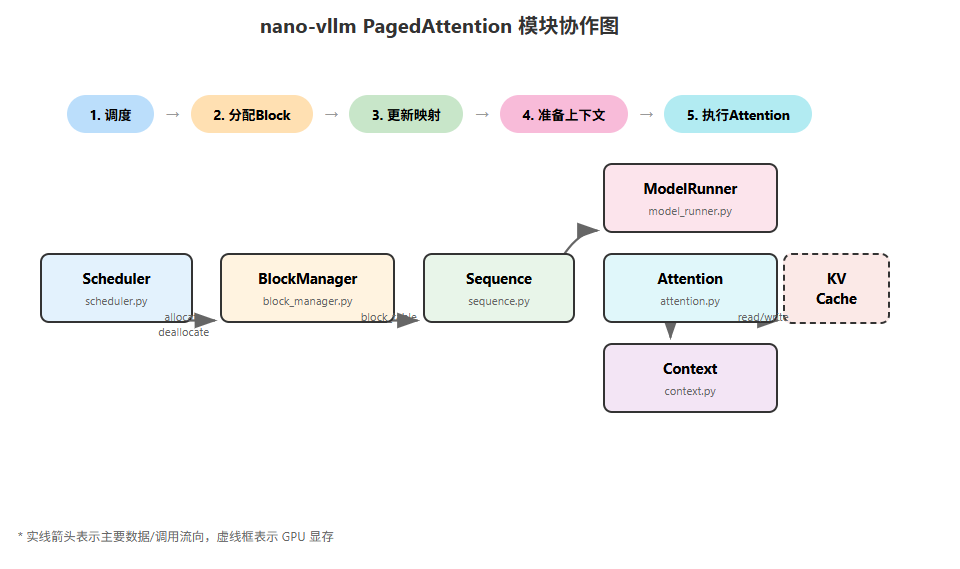
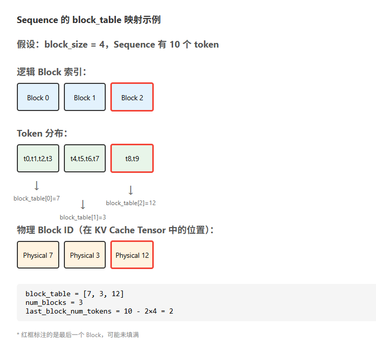
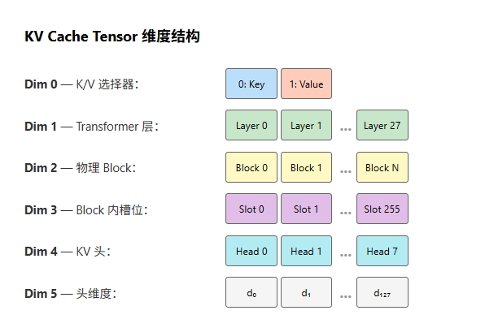

# PagedAttention 与内存管理

---

## 一、开篇引入

### 1.1 KV Cache 的内存瓶颈

在 Transformer 架构的大语言模型推理过程中，每生成一个新 token 都需要用到之前所有 token 的 Key 和 Value 向量。为避免重复计算，我们会将这些 KV 向量缓存起来，这就是 **KV Cache**。

KV Cache 的显存占用可以用以下公式估算：

```
KV Cache Size = 2 × num_layers × seq_len × num_kv_heads × head_dim × dtype_size
```

以 Qwen3-0.6B 为例（28层，8个KV头，64维，bf16）：
- 单个请求、序列长度 4096：`2 × 28 × 4096 × 8 × 64 × 2 = 234 MB`
- 如果同时服务 32 个请求：约 **7.34 GB** 显存仅用于 KV Cache

传统方案的问题在于 **预分配最大长度**。假设 `max_model_len = 4096`，即使一个请求实际只生成 100 个 token，也会预分配 4096 长度的 KV Cache 空间，导致 **60%-80% 的显存浪费**。此外，不同请求的实际长度参差不齐，容易产生 **显存碎片**。


### 1.2 PagedAttention 核心思想

PagedAttention 借鉴了操作系统虚拟内存管理的 **分页机制**：

| 操作系统概念 | PagedAttention 类比 |
|-------------|-------------------|
| 页（Page） | Block（固定大小的 KV Cache 块） |
| 页表（Page Table） | Block Table（逻辑位置到物理 Block 的映射） |
| slot | 预分配的 GPU 显存中的 Block 槽位 |
| 进程（Process） | Sequence（一个推理请求） |

核心优势：
- **按需分配**：只为实际生成的 token 分配 Block
- **动态管理**：请求结束后立即回收 Block 供其他请求使用
- **支持共享**：相同前缀的请求可共享 Block（Prefix Caching）

---

## 二、nano-vllm 代码结构总览

### 2.1 相关文件定位

```
nanovllm/
├── engine/
│   ├── block_manager.py   # Block 分配与回收、Prefix Caching
│   ├── sequence.py        # Sequence 数据结构（含 block_table）
│   ├── scheduler.py       # 调度器（调用 BlockManager）
│   └── model_runner.py    # KV Cache 物理显存分配、上下文准备
├── layers/
│   └── attention.py       # Attention 计算 + KV Cache 存取
├── utils/
│   └── context.py         # 运行时上下文（slot_mapping、block_tables等）
└── config.py              # kvcache_block_size 等配置
```

### 2.2 模块协作关系图

  


**核心协作流程**：

1. **Scheduler** 决定哪些 Sequence 参与本次迭代
2. **BlockManager** 为 Sequence 分配/回收 Block，更新 Sequence 的 `block_table`
3. **ModelRunner** 读取 Sequence 的 `block_table`，构造 `slot_mapping` 等上下文信息
4. **Context** 保存运行时上下文，供 Attention 层使用
5. **Attention** 根据上下文读写 KV Cache，完成注意力计算

---

## 三、核心类与方法详解

### 3.1 Block 类（block_manager.py）

Block 是 PagedAttention 的最小存储单元，代表 KV Cache 中的一个固定大小的槽位。

```python
class Block:
    """
    物理 Block，KV Cache 的最小存储单元。
    
    每个 Block 可存储 block_size 个 token 的 KV 向量。
    通过 ref_count 支持多个 Sequence 共享同一 Block（Prefix Caching）。
    通过 hash 和 token_ids 支持缓存查找和碰撞校验。
    """

    def __init__(self, block_id):
        # block_id: 物理 Block 的唯一标识，对应 KV Cache Tensor 的第 2 维索引
        # 创建后不变，范围是 [0, num_kvcache_blocks)
        self.block_id = block_id
        
        # ref_count: 引用计数
        # = 0: Block 空闲，在 free_block_ids 中
        # = 1: 被一个 Sequence 独占使用
        # > 1: 被多个 Sequence 共享（Prefix Caching 场景）
        self.ref_count = 0
        
        # hash: Block 内容的 xxhash 值，用于 Prefix Caching 快速查找
        # = -1: Block 未填满，或不参与缓存
        # != -1: Block 已填满，可被后续请求复用
        self.hash = -1
        
        # token_ids: Block 中存储的 token 序列
        # 用于 hash 碰撞时的精确校验，确保内容真正相同
        self.token_ids = []

    def update(self, hash: int, token_ids: list[int]):
        """
        更新 Block 的缓存标识。
        只在 Block 填满（包含完整 block_size 个 token）时调用。
        更新后，该 Block 可被后续具有相同前缀的请求复用。
        """
        self.hash = hash
        self.token_ids = token_ids

    def reset(self):
        """
        重置 Block 状态，供新分配使用。
        在从 free_block_ids 取出并分配给新 Sequence 时调用。
        """
        self.ref_count = 1      # 新分配，初始引用计数为 1
        self.hash = -1          # 清除旧的 hash（新内容待写入）
        self.token_ids = []     # 清除旧的 token_ids
```

### 3.2 BlockManager 类（block_manager.py）

BlockManager 是 Block 的管理器，负责分配、回收和 Prefix Caching。

```python
class BlockManager:
    """
    Block 管理器，PagedAttention 的核心组件。
    
    职责：
    1. 管理物理 Block 的分配和回收
    2. 维护空闲 Block 池
    3. 实现 Prefix Caching（通过 hash 索引和引用计数）
    """

    def __init__(self, num_blocks: int, block_size: int):
        # block_size: 每个 Block 容纳的 token 数，默认 256
        self.block_size = block_size
        
        # blocks: 所有物理 Block 实例的列表
        # 索引即 block_id，长度为 num_blocks
        self.blocks: list[Block] = [Block(i) for i in range(num_blocks)]
        
        # hash_to_block_id: hash 值到 block_id 的映射
        # Prefix Caching 的核心索引，用于 O(1) 查找是否存在相同内容的 Block
        self.hash_to_block_id: dict[int, int] = dict()
        
        # free_block_ids: 空闲 Block ID 队列
        # 使用 deque 实现 FIFO 分配策略
        self.free_block_ids: deque[int] = deque(range(num_blocks))
        
        # used_block_ids: 已使用的 Block ID 集合
        # 用于 O(1) 判断某个 Block 是否正在被使用
        self.used_block_ids: set[int] = set()

    @classmethod
    def compute_hash(cls, token_ids: list[int], prefix: int = -1):
        """
        计算 Block 内容的 hash 值。
        
        使用链式 hash：当前 Block 的 hash 依赖于前缀 Block 的 hash。
        这确保了只有「前缀完全相同」的 Block 序列才能匹配。
        
        Args:
            token_ids: 当前 Block 的 token 列表
            prefix: 前一个 Block 的 hash 值，-1 表示这是第一个 Block
        
        Returns:
            64 位整数 hash 值
        """
        h = xxhash.xxh64()
        if prefix != -1:
            # 将前缀 hash 纳入计算，实现链式依赖
            h.update(prefix.to_bytes(8, "little"))
        h.update(np.array(token_ids).tobytes())
        return h.intdigest()

    def _allocate_block(self, block_id: int) -> Block:
        """
        内部方法：将指定 Block 从空闲池移到已使用集合。
        """
        block = self.blocks[block_id]
        assert block.ref_count == 0  # 确保 Block 确实是空闲的
        block.reset()                # 重置状态
        self.free_block_ids.remove(block_id)
        self.used_block_ids.add(block_id)
        return self.blocks[block_id]

    def _deallocate_block(self, block_id: int) -> Block:
        """
        内部方法：将指定 Block 从已使用集合移回空闲池。
        注意：不清除 hash 和 token_ids，以便后续可能的缓存命中。
        """
        assert self.blocks[block_id].ref_count == 0
        self.used_block_ids.remove(block_id)
        self.free_block_ids.append(block_id)  # 放到队尾，FIFO

    def can_allocate(self, seq: Sequence) -> bool:
        """
        检查是否有足够的空闲 Block 为 Sequence 分配。
        
        这是保守估计，未考虑 Prefix Caching 命中可能减少的需求。
        实际分配时可能因缓存命中而需要更少的 Block。
        """
        return len(self.free_block_ids) >= seq.num_blocks

    def allocate(self, seq: Sequence):
        """
        为 Sequence 分配 Block，核心方法。
        
        包含完整的 Prefix Caching 逻辑：
        1. 遍历 Sequence 的每个逻辑 Block
        2. 计算链式 hash，查找缓存
        3. 缓存命中则复用，未命中则新分配
        4. 更新 Sequence 的 block_table
        
        调用时机：Prefill 阶段，新请求开始执行时
        """
        assert not seq.block_table  # 确保是新请求，block_table 应为空
        h = -1                       # 前缀 hash，用于链式计算
        cache_miss = False           # 一旦发生 miss，后续都是 miss
        
        for i in range(seq.num_blocks):
            token_ids = seq.block(i)  # 获取第 i 个逻辑 Block 的 token
            
            # 只有完整 Block（包含 block_size 个 token）才计算 hash
            # 最后一个未填满的 Block 不参与缓存
            h = self.compute_hash(token_ids, h) if len(token_ids) == self.block_size else -1
            
            # 在缓存索引中查找
            block_id = self.hash_to_block_id.get(h, -1)
            
            # 双重校验：hash 匹配 + 内容匹配
            # 防止 hash 碰撞或 Block 被覆写导致的错误命中
            if block_id == -1 or self.blocks[block_id].token_ids != token_ids:
                cache_miss = True
            
            if cache_miss:
                # Cache Miss：从空闲池分配新 Block
                block_id = self.free_block_ids[0]
                block = self._allocate_block(block_id)
            else:
                # Cache Hit：复用已有 Block
                seq.num_cached_tokens += self.block_size  # 累加缓存命中的 token 数
                if block_id in self.used_block_ids:
                    # Block 正被其他 Sequence 使用，增加引用计数
                    block = self.blocks[block_id]
                    block.ref_count += 1
                else:
                    # Block 在空闲池中（之前被回收但 hash 保留），重新激活
                    block = self._allocate_block(block_id)
            
            # 更新 Block 的 hash 和 token_ids（仅完整 Block）
            if h != -1:
                block.update(h, token_ids)
                self.hash_to_block_id[h] = block_id
            
            # 将 block_id 加入 Sequence 的 block_table
            seq.block_table.append(block_id)

    def deallocate(self, seq: Sequence):
        """
        释放 Sequence 占用的所有 Block。
        
        通过引用计数实现：
        - ref_count 减 1
        - 只有当 ref_count 降为 0 时才真正释放
        
        调用时机：
        1. 请求完成（postprocess 中检测到 EOS 或达到 max_tokens）
        2. 请求被抢占（preempt）
        """
        for block_id in reversed(seq.block_table):  # 逆序遍历（栈语义）
            block = self.blocks[block_id]
            block.ref_count -= 1
            if block.ref_count == 0:
                self._deallocate_block(block_id)
        seq.num_cached_tokens = 0
        seq.block_table.clear()

    def can_append(self, seq: Sequence) -> bool:
        """
        检查是否能为 Sequence 追加新 token（可能需要新 Block）。
        
        只有当 len(seq) % block_size == 1 时（即上一个 Block 刚满），
        才需要分配新 Block。其他情况直接写入现有 Block。
        
        调用时机：Decode 阶段，每次迭代前检查
        """
        return len(self.free_block_ids) >= (len(seq) % self.block_size == 1)

    def may_append(self, seq: Sequence):
        """
        Decode 阶段追加 Block 的处理。
        
        三种情况：
        1. len % block_size == 1: 需要新 Block（上一个已满）
        2. len % block_size == 0: 当前 Block 刚填满，更新其 hash
        3. 其他: Block 正在填充中，无需操作
        
        调用时机：Decode 阶段，can_append 返回 True 后调用
        """
        block_table = seq.block_table
        last_block = self.blocks[block_table[-1]]
        
        if len(seq) % self.block_size == 1:
            # 情况1：刚好需要新 Block（上一个已满）
            assert last_block.hash != -1  # 上一个 Block 应该已经完整并有 hash
            block_id = self.free_block_ids[0]
            self._allocate_block(block_id)
            block_table.append(block_id)
            
        elif len(seq) % self.block_size == 0:
            # 情况2：当前 Block 刚好填满，更新其 hash（供后续 Prefix Cache）
            assert last_block.hash == -1  # 之前应该是未完成状态
            token_ids = seq.block(seq.num_blocks - 1)
            prefix = self.blocks[block_table[-2]].hash if len(block_table) > 1 else -1
            h = self.compute_hash(token_ids, prefix)
            last_block.update(h, token_ids)
            self.hash_to_block_id[h] = last_block.block_id
            
        else:
            # 情况3：Block 正在填充中，无需操作
            assert last_block.hash == -1  # 确认是未完成状态
```

### 3.3 Sequence 类（sequence.py）

Sequence 代表一个推理请求，包含 token 序列和 Block 映射信息。

```python
class SequenceStatus(Enum):
    """Sequence 的状态枚举"""
    WAITING = auto()   # 等待调度
    RUNNING = auto()   # 正在执行
    FINISHED = auto()  # 已完成


class Sequence:
    """
    推理请求的抽象，包含输入 token、生成状态和 Block 映射。
    
    核心职责：
    1. 存储 prompt 和生成的 token
    2. 维护 block_table（逻辑 Block 到物理 Block 的映射）
    3. 记录 Prefix Caching 命中信息
    """
    
    # 类变量：所有 Sequence 共享的 Block 大小
    block_size = 256
    
    # 类变量：Sequence ID 生成器，确保每个请求有唯一 ID
    counter = count()

    def __init__(self, token_ids: list[int], sampling_params=SamplingParams()):
        # seq_id: 唯一标识符，用于结果排序和追踪
        self.seq_id = next(Sequence.counter)
        
        # status: 当前状态（WAITING -> RUNNING -> FINISHED）
        self.status = SequenceStatus.WAITING
        
        # token_ids: 完整的 token 序列（prompt + 已生成的 token）
        # 使用 copy 避免外部修改影响
        self.token_ids = copy(token_ids)
        
        # last_token: 最后一个 token，Decode 阶段的输入
        self.last_token = token_ids[-1]
        
        # num_tokens: 当前总 token 数（prompt + 已生成）
        self.num_tokens = len(self.token_ids)
        
        # num_prompt_tokens: prompt 的 token 数，不变
        self.num_prompt_tokens = len(token_ids)
        
        # num_cached_tokens: Prefix Caching 命中的 token 数
        # 由 BlockManager.allocate 设置，用于跳过已缓存部分的计算
        self.num_cached_tokens = 0
        
        # block_table: 逻辑 Block 索引 -> 物理 Block ID 的映射
        # 例如 [7, 3, 12] 表示：
        #   逻辑 Block 0 -> 物理 Block 7
        #   逻辑 Block 1 -> 物理 Block 3
        #   逻辑 Block 2 -> 物理 Block 12
        self.block_table = []
        
        # 采样参数
        self.temperature = sampling_params.temperature
        self.max_tokens = sampling_params.max_tokens
        self.ignore_eos = sampling_params.ignore_eos

    def __len__(self):
        """返回当前 token 总数"""
        return self.num_tokens

    def __getitem__(self, key):
        """支持切片访问 token_ids"""
        return self.token_ids[key]

    @property
    def is_finished(self):
        """是否已完成"""
        return self.status == SequenceStatus.FINISHED

    @property
    def num_completion_tokens(self):
        """已生成的 token 数（不含 prompt）"""
        return self.num_tokens - self.num_prompt_tokens

    @property
    def prompt_token_ids(self):
        """prompt 部分的 token"""
        return self.token_ids[:self.num_prompt_tokens]

    @property
    def completion_token_ids(self):
        """生成部分的 token"""
        return self.token_ids[self.num_prompt_tokens:]

    @property
    def num_cached_blocks(self):
        """Prefix Caching 命中的 Block 数"""
        return self.num_cached_tokens // self.block_size

    @property
    def num_blocks(self):
        """
        当前需要的 Block 总数。
        向上取整：(num_tokens + block_size - 1) // block_size
        """
        return (self.num_tokens + self.block_size - 1) // self.block_size

    @property
    def last_block_num_tokens(self):
        """
        最后一个 Block 中的 token 数量。
        可能不满 block_size（正在填充中）。
        """
        return self.num_tokens - (self.num_blocks - 1) * self.block_size

    def block(self, i):
        """
        获取第 i 个逻辑 Block 对应的 token 列表。
        用于计算 hash 和内容校验。
        """
        assert 0 <= i < self.num_blocks
        return self.token_ids[i * self.block_size: (i + 1) * self.block_size]

    def append_token(self, token_id: int):
        """
        追加新生成的 token。
        在 Scheduler.postprocess 中调用。
        """
        self.token_ids.append(token_id)
        self.last_token = token_id
        self.num_tokens += 1

    def __getstate__(self):
        """
        序列化支持（用于多进程通信）。
        只传输必要的字段，减少通信开销。
        """
        return (self.num_tokens, self.num_prompt_tokens, self.num_cached_tokens, 
                self.block_table,
                self.token_ids if self.num_completion_tokens == 0 else self.last_token)

    def __setstate__(self, state):
        """反序列化"""
        self.num_tokens, self.num_prompt_tokens, self.num_cached_tokens, self.block_table = state[:-1]
        if self.num_completion_tokens == 0:
            self.token_ids = state[-1]
        else:
            self.last_token = state[-1]
```

**block_table 映射关系图**：

  

### 3.4 KV Cache 物理存储（model_runner.py 部分代码）

KV Cache 的物理存储由 `ModelRunner.allocate_kv_cache()` 方法创建。

```python
def allocate_kv_cache(self):
    """
    分配 KV Cache 的 GPU 显存。
    
    根据可用显存自动计算可分配的 Block 数量，
    然后预分配一个大的 Tensor 作为所有 Block 的存储。
    
    调用时机：ModelRunner 初始化时，模型加载后
    """
    config = self.config
    hf_config = config.hf_config
    
    # 1. 获取 GPU 显存信息
    free, total = torch.cuda.mem_get_info()
    used = total - free
    # peak: 模型加载和预热过程中的峰值显存
    peak = torch.cuda.memory_stats()["allocated_bytes.all.peak"]
    # current: 当前已分配的显存
    current = torch.cuda.memory_stats()["allocated_bytes.all.current"]
    
    # 2. 计算单个 Block 的显存占用
    # 考虑张量并行：每个 GPU 只存储部分 KV 头
    num_kv_heads = hf_config.num_key_value_heads // self.world_size
    block_bytes = (2 *                              # K 和 V
                   hf_config.num_hidden_layers *    # 层数（如 28）
                   self.block_size *                # block_size（如 256）
                   num_kv_heads *                   # KV 头数（如 8）
                   hf_config.head_dim *             # 头维度（如 128）
                   hf_config.torch_dtype.itemsize)  # 数据类型大小（如 2 for bf16）
    
    # 3. 计算可分配的 Block 数量
    # 可用显存 = 总显存 × 利用率 - 已用 - (峰值 - 当前)
    available = total * config.gpu_memory_utilization - used - peak + current
    config.num_kvcache_blocks = int(available) // block_bytes
    assert config.num_kvcache_blocks > 0, "Not enough GPU memory for KV Cache"
    
    # 4. 预分配 KV Cache Tensor
    # 形状: [2, num_layers, num_blocks, block_size, num_kv_heads, head_dim]
    self.kv_cache = torch.empty(
        2,                              # 0: Key, 1: Value
        hf_config.num_hidden_layers,    # 层数
        config.num_kvcache_blocks,      # Block 数量
        self.block_size,                # 每个 Block 的 token 数
        num_kv_heads,                   # KV 头数
        hf_config.head_dim              # 头维度
    )
    
    # 5. 将 KV Cache 切片绑定到每个 Attention 层
    # 每层获得 [num_blocks, block_size, num_kv_heads, head_dim] 的视图
    layer_id = 0
    for module in self.model.modules():
        if hasattr(module, "k_cache") and hasattr(module, "v_cache"):
            module.k_cache = self.kv_cache[0, layer_id]  # 该层的 K Cache
            module.v_cache = self.kv_cache[1, layer_id]  # 该层的 V Cache
            layer_id += 1
```

**KV Cache Tensor 结构图**：

  


### 3.5 Context 上下文（context.py）

Context 是运行时上下文的容器，保存 Attention 计算所需的各种索引信息。

```python
@dataclass
class Context:
    """
    运行时上下文，保存当前迭代的 Attention 计算所需信息。
    
    使用全局单例模式，通过 set_context/get_context/reset_context 访问。
    这样 Attention 层可以无需修改接口即可获取调度信息。
    """
    
    # is_prefill: 当前是否为 Prefill 阶段
    # True: Prefill，处理完整 prompt
    # False: Decode，处理单个 token
    is_prefill: bool = False
    
    # cu_seqlens_q: Query 的累积序列长度（仅 Prefill 使用）
    # 例如 [0, 100, 250, 400] 表示 3 个序列，长度分别为 100, 150, 150
    # flash_attn_varlen_func 需要此参数处理变长序列拼接
    cu_seqlens_q: torch.Tensor | None = None
    
    # cu_seqlens_k: Key 的累积序列长度（仅 Prefill 使用）
    # 通常与 cu_seqlens_q 相同，但 Prefix Cache 时可能不同
    # （Query 只包含非缓存 token，Key 包含全部）
    cu_seqlens_k: torch.Tensor | None = None
    
    # max_seqlen_q: 批次中最长的 Query 序列长度（仅 Prefill 使用）
    max_seqlen_q: int = 0
    
    # max_seqlen_k: 批次中最长的 Key 序列长度（仅 Prefill 使用）
    max_seqlen_k: int = 0
    
    # slot_mapping: token 到 KV Cache 槽位的映射（Prefill 和 Decode 都使用）
    # Prefill: 长度 = 非缓存 token 总数
    # Decode: 长度 = batch_size（每个序列一个新 token）
    # 槽位计算: block_id * block_size + offset_in_block
    slot_mapping: torch.Tensor | None = None
    
    # context_lens: 每个序列的上下文长度（仅 Decode 使用）
    # flash_attn_with_kvcache 需要知道每个序列要读取多少历史 KV
    context_lens: torch.Tensor | None = None
    
    # block_tables: 批量 block_table（Decode 和 Prefix Cache 时使用）
    # 形状: [batch_size, max_blocks]
    # 每行是一个序列的 block_table，不足部分填充 -1
    block_tables: torch.Tensor | None = None


# 全局上下文实例
_CONTEXT = Context()


def get_context():
    """获取当前上下文（在 Attention.forward 中调用）"""
    return _CONTEXT


def set_context(is_prefill, cu_seqlens_q=None, cu_seqlens_k=None, 
                max_seqlen_q=0, max_seqlen_k=0, slot_mapping=None, 
                context_lens=None, block_tables=None):
    """
    设置上下文（在 ModelRunner.prepare_prefill/prepare_decode 中调用）
    """
    global _CONTEXT
    _CONTEXT = Context(is_prefill, cu_seqlens_q, cu_seqlens_k, 
                       max_seqlen_q, max_seqlen_k, slot_mapping, 
                       context_lens, block_tables)


def reset_context():
    """重置上下文（在 ModelRunner.run 结束时调用）"""
    global _CONTEXT
    _CONTEXT = Context()
```

### 3.6 Attention 层的 KV Cache 操作（attention.py）

```python
@triton.jit
def store_kvcache_kernel(
    key_ptr,            # 输入 K 张量的指针
    key_stride,         # K 张量在 token 维度的步长
    value_ptr,          # 输入 V 张量的指针
    value_stride,       # V 张量在 token 维度的步长
    k_cache_ptr,        # K Cache 张量的指针
    v_cache_ptr,        # V Cache 张量的指针
    slot_mapping_ptr,   # slot_mapping 的指针
    D: tl.constexpr,    # 每个 token 的 KV 维度 (num_heads * head_dim)
):
    """
    Triton Kernel：将 K、V 向量写入 KV Cache 的指定槽位。
    
    为什么用 Triton 而非 PyTorch：
    1. slot_mapping 指定的位置不连续，PyTorch 索引操作效率低
    2. Triton 可以并行处理所有 token，每个 token 一个线程块
    3. 合并读写，减少显存带宽压力
    """
    # 当前处理的 token 索引（每个线程块处理一个 token）
    idx = tl.program_id(0)
    
    # 获取目标槽位
    slot = tl.load(slot_mapping_ptr + idx)
    
    # slot = -1 是 CUDA Graph 填充的无效位置，跳过
    if slot == -1:
        return
    
    # 从输入张量加载 K 和 V
    key_offsets = idx * key_stride + tl.arange(0, D)
    value_offsets = idx * value_stride + tl.arange(0, D)
    key = tl.load(key_ptr + key_offsets)
    value = tl.load(value_ptr + value_offsets)
    
    # 写入 Cache
    cache_offsets = slot * D + tl.arange(0, D)
    tl.store(k_cache_ptr + cache_offsets, key)
    tl.store(v_cache_ptr + cache_offsets, value)


def store_kvcache(key: torch.Tensor, value: torch.Tensor, 
                  k_cache: torch.Tensor, v_cache: torch.Tensor, 
                  slot_mapping: torch.Tensor):
    """
    Python 封装：调用 Triton Kernel 写入 KV Cache。
    
    Args:
        key: 当前计算的 K，形状 [N, num_heads, head_dim]
        value: 当前计算的 V，形状 [N, num_heads, head_dim]
        k_cache: K Cache，形状 [num_blocks, block_size, num_heads, head_dim]
        v_cache: V Cache，形状同上
        slot_mapping: 槽位映射，形状 [N]
    """
    N, num_heads, head_dim = key.shape
    D = num_heads * head_dim
    # 验证张量布局
    assert key.stride(-1) == 1 and value.stride(-1) == 1
    assert key.stride(1) == head_dim and value.stride(1) == head_dim
    assert k_cache.stride(1) == D and v_cache.stride(1) == D
    assert slot_mapping.numel() == N
    # 启动 Kernel，每个 token 一个线程块
    store_kvcache_kernel[(N,)](
        key, key.stride(0), 
        value, value.stride(0), 
        k_cache, v_cache, 
        slot_mapping, D
    )


class Attention(nn.Module):
    """
    Attention 层，集成 KV Cache 的读写和 Attention 计算。
    
    支持两种模式：
    1. Prefill: 使用 flash_attn_varlen_func 处理变长序列
    2. Decode: 使用 flash_attn_with_kvcache 处理单 token
    """

    def __init__(self, num_heads, head_dim, scale, num_kv_heads):
        super().__init__()
        self.num_heads = num_heads
        self.head_dim = head_dim
        self.scale = scale
        self.num_kv_heads = num_kv_heads
        # k_cache 和 v_cache 在 ModelRunner.allocate_kv_cache 中绑定
        self.k_cache = self.v_cache = torch.tensor([])

    def forward(self, q: torch.Tensor, k: torch.Tensor, v: torch.Tensor):
        """
        执行 Attention 计算。
        
        Args:
            q: Query，形状 [N, num_heads, head_dim]
            k: Key，形状 [N, num_kv_heads, head_dim]
            v: Value，形状同上
        
        Returns:
            输出，形状同 q
        """
        # 获取当前上下文
        context = get_context()
        k_cache, v_cache = self.k_cache, self.v_cache
        
        # 1. 将当前计算的 K、V 写入 Cache
        if k_cache.numel() and v_cache.numel():
            store_kvcache(k, v, k_cache, v_cache, context.slot_mapping)
        
        # 2. 根据阶段选择 Attention 计算方式
        if context.is_prefill:
            # Prefill 阶段
            if context.block_tables is not None:
                # Prefix Cache 命中：从 Cache 读取历史 KV
                # 传入的 k, v 只包含新计算的 token
                # flash_attn 内部会根据 block_table 拼接历史 KV
                k, v = k_cache, v_cache
            
            o = flash_attn_varlen_func(
                q, k, v,
                max_seqlen_q=context.max_seqlen_q,
                cu_seqlens_q=context.cu_seqlens_q,
                max_seqlen_k=context.max_seqlen_k,
                cu_seqlens_k=context.cu_seqlens_k,
                softmax_scale=self.scale,
                causal=True,
                block_table=context.block_tables
            )
        else:
            # Decode 阶段
            # q: [batch_size, num_heads, head_dim] -> [batch_size, 1, num_heads, head_dim]
            o = flash_attn_with_kvcache(
                q.unsqueeze(1),
                k_cache, v_cache,
                cache_seqlens=context.context_lens,  # 每个序列的历史长度
                block_table=context.block_tables,     # 定位 Cache 中的 KV
                softmax_scale=self.scale,
                causal=True
            )
        return o
```

### 3.7 Scheduler 调度器（scheduler.py）

```python
class Scheduler:
    """
    调度器，决定每次迭代执行哪些 Sequence。
    
    核心职责：
    1. 管理 waiting 和 running 队列
    2. 调用 BlockManager 分配/回收 Block
    3. 实现 Prefill 优先和抢占机制
    """

    def __init__(self, config: Config):
        self.max_num_seqs = config.max_num_seqs
        self.max_num_batched_tokens = config.max_num_batched_tokens
        self.eos = config.eos
        
        # BlockManager 实例
        self.block_manager = BlockManager(config.num_kvcache_blocks, 
                                          config.kvcache_block_size)
        
        # waiting: 等待执行的新请求队列
        self.waiting: deque[Sequence] = deque()
        
        # running: 正在执行的请求队列（已完成 Prefill，在 Decode）
        self.running: deque[Sequence] = deque()

    def is_finished(self):
        """检查是否所有请求都已完成"""
        return not self.waiting and not self.running

    def add(self, seq: Sequence):
        """添加新请求到等待队列"""
        self.waiting.append(seq)

    def schedule(self) -> tuple[list[Sequence], bool]:
        """
        调度方法，选择本次迭代要执行的 Sequence。
        
        调度策略：
        1. Prefill 优先：先处理 waiting 队列中的新请求
        2. 资源不足时：Prefill 跳过等待，Decode 抢占
        
        Returns:
            (scheduled_seqs, is_prefill): 被调度的序列列表和是否为 Prefill 阶段
        """
        scheduled_seqs = []
        num_seqs = 0
        num_batched_tokens = 0
        
        # ========== Prefill 调度 ==========
        while self.waiting and num_seqs < self.max_num_seqs:
            seq = self.waiting[0]
            
            # 检查 token 数量限制
            if num_batched_tokens + len(seq) > self.max_num_batched_tokens:
                break
            
            # 检查 Block 是否足够
            if not self.block_manager.can_allocate(seq):
                break
            
            # 分配 Block
            num_seqs += 1
            self.block_manager.allocate(seq)
            
            # 更新 token 计数（只计算非缓存 token）
            num_batched_tokens += len(seq) - seq.num_cached_tokens
            
            # 状态转移：WAITING -> RUNNING
            seq.status = SequenceStatus.RUNNING
            self.waiting.popleft()
            self.running.append(seq)
            scheduled_seqs.append(seq)
        
        # 如果有 Prefill 请求，直接返回
        if scheduled_seqs:
            return scheduled_seqs, True  # is_prefill = True
        
        # ========== Decode 调度 ==========
        while self.running and num_seqs < self.max_num_seqs:
            seq = self.running.popleft()
            
            # 检查是否能追加新 token
            while not self.block_manager.can_append(seq):
                # 资源不足，需要抢占
                if self.running:
                    # 抢占最后进入的请求（LIFO 策略）
                    self.preempt(self.running.pop())
                else:
                    # 无法继续，抢占自己
                    self.preempt(seq)
                    break
            else:
                # 可以继续执行
                num_seqs += 1
                self.block_manager.may_append(seq)
                scheduled_seqs.append(seq)
        
        # 将调度的序列放回队首
        assert scheduled_seqs
        self.running.extendleft(reversed(scheduled_seqs))
        return scheduled_seqs, False  # is_prefill = False

    def preempt(self, seq: Sequence):
        """
        抢占：暂停一个正在执行的 Sequence，释放其资源。
        
        被抢占的 Sequence 会回到 waiting 队列头部，
        等待资源可用时优先恢复执行。
        """
        seq.status = SequenceStatus.WAITING
        self.block_manager.deallocate(seq)  # 释放所有 Block
        self.waiting.appendleft(seq)         # 放到等待队列头部

    def postprocess(self, seqs: list[Sequence], token_ids: list[int]):
        """
        后处理：更新 Sequence 状态，检查终止条件。
        
        在每次迭代后调用，处理采样结果。
        """
        for seq, token_id in zip(seqs, token_ids):
            # 追加新 token
            seq.append_token(token_id)
            
            # 检查终止条件
            is_eos = not seq.ignore_eos and token_id == self.eos
            is_max_tokens = seq.num_completion_tokens == seq.max_tokens
            
            if is_eos or is_max_tokens:
                seq.status = SequenceStatus.FINISHED
                self.block_manager.deallocate(seq)  # 释放 Block
                self.running.remove(seq)
```

---

## 四、Prefill 流程全解析

### 4.1 流程概述

Prefill 阶段处理新请求的 prompt，一次性计算所有 prompt token 的 KV Cache 并生成第一个 token。

```html
<!DOCTYPE html>
<html>
<head>
    <style>
        .prefill-container {
            background-color: white;
            padding: 30px;
            font-family: 'Segoe UI', Arial, sans-serif;
        }
        .prefill-title {
            font-size: 16px;
            font-weight: bold;
            margin-bottom: 25px;
            text-align: center;
        }
        .prefill-flow {
            display: flex;
            flex-direction: column;
            align-items: center;
        }
        .prefill-step {
            display: flex;
            align-items: center;
            margin-bottom: 15px;
            width: 100%;
            max-width: 700px;
        }
        .prefill-num {
            width: 30px;
            height: 30px;
            border-radius: 50%;
            background: #1976D2;
            color: white;
            display: flex;
            align-items: center;
            justify-content: center;
            font-weight: bold;
            margin-right: 15px;
            flex-shrink: 0;
        }
        .prefill-box {
            flex: 1;
            padding: 12px 18px;
            border: 2px solid #333;
            border-radius: 8px;
            font-size: 13px;
        }
        .prefill-module {
            font-weight: bold;
            color: #1976D2;
        }
        .prefill-method {
            font-family: 'Consolas', monospace;
            background: #E3F2FD;
            padding: 2px 6px;
            border-radius: 3px;
            font-size: 12px;
        }
        .prefill-arrow {
            font-size: 20px;
            color: #666;
            margin: 5px 0;
        }
        .prefill-detail {
            color: #666;
            font-size: 12px;
            margin-top: 5px;
        }
    </style>
</head>
<body>
    <div class="prefill-container">
        <div class="prefill-title">Prefill 阶段函数调用链</div>
        <div class="prefill-flow">
            <div class="prefill-step">
                <div class="prefill-num">1</div>
                <div class="prefill-box" style="background: #E3F2FD;">
                    <span class="prefill-module">LLMEngine</span>.<span class="prefill-method">add_request(prompt, params)</span>
                    <div class="prefill-detail">创建 Sequence，加入 waiting 队列</div>
                </div>
            </div>
            <div class="prefill-arrow">↓</div>
            <div class="prefill-step">
                <div class="prefill-num">2</div>
                <div class="prefill-box" style="background: #FFF3E0;">
                    <span class="prefill-module">Scheduler</span>.<span class="prefill-method">schedule()</span>
                    <div class="prefill-detail">检查 can_allocate → 调用 allocate → 返回 (seqs, is_prefill=True)</div>
                </div>
            </div>
            <div class="prefill-arrow">↓</div>
            <div class="prefill-step">
                <div class="prefill-num">3</div>
                <div class="prefill-box" style="background: #FCE4EC;">
                    <span class="prefill-module">ModelRunner</span>.<span class="prefill-method">prepare_prefill(seqs)</span>
                    <div class="prefill-detail">构造 input_ids, positions, slot_mapping, cu_seqlens → set_context</div>
                </div>
            </div>
            <div class="prefill-arrow">↓</div>
            <div class="prefill-step">
                <div class="prefill-num">4</div>
                <div class="prefill-box" style="background: #E0F7FA;">
                    <span class="prefill-module">Attention</span>.<span class="prefill-method">forward(q, k, v)</span>
                    <div class="prefill-detail">store_kvcache 写入 → flash_attn_varlen_func 计算</div>
                </div>
            </div>
            <div class="prefill-arrow">↓</div>
            <div class="prefill-step">
                <div class="prefill-num">5</div>
                <div class="prefill-box" style="background: #E8F5E9;">
                    <span class="prefill-module">Sampler</span>.<span class="prefill-method">forward(logits, temperatures)</span>
                    <div class="prefill-detail">采样生成第一个 token</div>
                </div>
            </div>
            <div class="prefill-arrow">↓</div>
            <div class="prefill-step">
                <div class="prefill-num">6</div>
                <div class="prefill-box" style="background: #F3E5F5;">
                    <span class="prefill-module">Scheduler</span>.<span class="prefill-method">postprocess(seqs, token_ids)</span>
                    <div class="prefill-detail">追加 token 到 Sequence，检查终止条件</div>
                </div>
            </div>
        </div>
    </div>
</body>
</html>
```

### 4.2 Step 1-2：调度与 Block 分配

Scheduler 从 waiting 队列取出新请求，调用 BlockManager.allocate 分配 Block。

在 `allocate` 内部，会进行 Prefix Caching 的匹配：
- 逐个 Block 计算链式 hash
- 在 `hash_to_block_id` 中查找匹配
- 命中则复用，增加 `ref_count`，累加 `num_cached_tokens`
- 未命中则从 `free_block_ids` 分配新 Block

### 4.3 Step 3：准备运行时上下文

ModelRunner.prepare_prefill 根据 Sequence 信息构造 Attention 所需的上下文：

```python
def prepare_prefill(self, seqs: list[Sequence]):
    input_ids = []
    positions = []
    cu_seqlens_q = [0]
    cu_seqlens_k = [0]
    slot_mapping = []
    
    for seq in seqs:
        seqlen = len(seq)
        
        # 只包含非缓存的 token（Prefix Cache 优化）
        input_ids.extend(seq[seq.num_cached_tokens:])
        positions.extend(list(range(seq.num_cached_tokens, seqlen)))
        
        # Query 长度：非缓存 token 数
        seqlen_q = seqlen - seq.num_cached_tokens
        # Key 长度：全部 token 数（包括缓存的）
        seqlen_k = seqlen
        
        cu_seqlens_q.append(cu_seqlens_q[-1] + seqlen_q)
        cu_seqlens_k.append(cu_seqlens_k[-1] + seqlen_k)
        
        # 构造 slot_mapping：只为非缓存 token 生成
        for i in range(seq.num_cached_blocks, seq.num_blocks):
            start = seq.block_table[i] * self.block_size
            end = start + (self.block_size if i != seq.num_blocks - 1 
                          else seq.last_block_num_tokens)
            slot_mapping.extend(list(range(start, end)))
    
    # 如果有 Prefix Cache 命中，需要传递 block_tables
    if cu_seqlens_k[-1] > cu_seqlens_q[-1]:
        block_tables = self.prepare_block_tables(seqs)
    
    # 设置全局上下文
    set_context(True, cu_seqlens_q, cu_seqlens_k, ...)
    return input_ids, positions
```

**slot_mapping 构造图示**：

```html
<!DOCTYPE html>
<html>
<head>
    <style>
        .slot-container {
            background-color: white;
            padding: 30px;
            font-family: 'Segoe UI', Arial, sans-serif;
        }
        .slot-title {
            font-size: 15px;
            font-weight: bold;
            margin-bottom: 20px;
        }
        .slot-row {
            display: flex;
            align-items: center;
            margin-bottom: 12px;
        }
        .slot-label {
            width: 130px;
            font-size: 12px;
            color: #555;
            font-weight: bold;
        }
        .slot-cells {
            display: flex;
        }
        .slot-cell {
            width: 38px;
            height: 32px;
            border: 1px solid #666;
            display: flex;
            align-items: center;
            justify-content: center;
            font-size: 10px;
            margin-right: 2px;
            border-radius: 3px;
        }
        .slot-cached { background: #E0E0E0; color: #999; }
        .slot-new { background: #C8E6C9; }
        .slot-result {
            margin-top: 20px;
            padding: 12px 15px;
            background: #FFF3E0;
            border-radius: 5px;
            font-family: 'Consolas', monospace;
            font-size: 12px;
        }
        .slot-note {
            font-size: 11px;
            color: #888;
            margin-top: 12px;
        }
    </style>
</head>
<body>
    <div class="slot-container">
        <div class="slot-title">Prefill slot_mapping 构造示例（block_size=4, 2个Block缓存命中）</div>
        
        <div class="slot-row">
            <div class="slot-label">Token 序列：</div>
            <div class="slot-cells">
                <div class="slot-cell slot-cached">t0</div>
                <div class="slot-cell slot-cached">t1</div>
                <div class="slot-cell slot-cached">t2</div>
                <div class="slot-cell slot-cached">t3</div>
                <div class="slot-cell slot-cached">t4</div>
                <div class="slot-cell slot-cached">t5</div>
                <div class="slot-cell slot-cached">t6</div>
                <div class="slot-cell slot-cached">t7</div>
                <div class="slot-cell slot-new">t8</div>
                <div class="slot-cell slot-new">t9</div>
                <div class="slot-cell slot-new">t10</div>
                <div class="slot-cell slot-new">t11</div>
                <div class="slot-cell slot-new">t12</div>
                <div class="slot-cell slot-new">t13</div>
            </div>
        </div>
        
        <div class="slot-row">
            <div class="slot-label">Block 划分：</div>
            <div class="slot-cells">
                <div style="width: 160px; text-align: center; font-size: 11px; color: #999;">Block 0-1 (缓存命中)</div>
                <div style="width: 80px; text-align: center; font-size: 11px; color: #4CAF50;">Block 2</div>
                <div style="width: 80px; text-align: center; font-size: 11px; color: #4CAF50;">Block 3</div>
            </div>
        </div>
        
        <div class="slot-row">
            <div class="slot-label">block_table：</div>
            <div style="font-size: 12px;">[5, 8, 3, 12] (物理 Block ID)</div>
        </div>
        
        <div class="slot-result">
            <strong>slot_mapping 计算：</strong><br><br>
            Block 2 (physical=3): slots = [3×4+0, 3×4+1, 3×4+2, 3×4+3] = [12, 13, 14, 15]<br>
            Block 3 (physical=12): slots = [12×4+0, 12×4+1] = [48, 49]<br><br>
            <strong>最终：</strong> slot_mapping = [12, 13, 14, 15, 48, 49]
        </div>
        
        <div class="slot-note">
            * 灰色 token (t0-t7) 已缓存，不在 input_ids 中，不生成 slot_mapping<br>
            * input_ids = [t8, t9, t10, t11, t12, t13]，长度为 6
        </div>
    </div>
</body>
</html>
```

### 4.4 Step 4-6：Attention 计算与采样

1. **Attention.forward** 调用 `store_kvcache` 将新计算的 KV 写入 Cache
2. 调用 `flash_attn_varlen_func` 进行 Attention 计算
3. **Sampler** 对 logits 采样，生成第一个 token
4. **postprocess** 将新 token 追加到 Sequence

---

## 五、Decode 流程全解析

### 5.1 流程概述

Decode 阶段逐个生成 token，每次迭代只处理一个 token，但可以批量处理多个 Sequence。

**与 Prefill 的关键差异**：

| 方面 | Prefill | Decode |
|------|---------|--------|
| Token 数量 | 多个（整个 prompt） | 每个 Sequence 1 个 |
| Block 操作 | allocate（分配多个） | may_append（追加 0~1 个） |
| Attention 函数 | flash_attn_varlen_func | flash_attn_with_kvcache |
| slot_mapping | 多个 slot | 每个 Sequence 1 个 slot |
| 资源不足处理 | 跳过等待 | 抢占其他请求 |

### 5.2 调度与 Block 追加

```python
# Scheduler.schedule() 中的 Decode 部分
while self.running and num_seqs < self.max_num_seqs:
    seq = self.running.popleft()
    
    # 检查是否能追加
    while not self.block_manager.can_append(seq):
        if self.running:
            self.preempt(self.running.pop())  # 抢占
        else:
            self.preempt(seq)
            break
    else:
        num_seqs += 1
        self.block_manager.may_append(seq)
        scheduled_seqs.append(seq)
```

**may_append 的三种情况**：

```html
<!DOCTYPE html>
<html>
<head>
    <style>
        .append-container {
            background-color: white;
            padding: 30px;
            font-family: 'Segoe UI', Arial, sans-serif;
        }
        .append-title {
            font-size: 15px;
            font-weight: bold;
            margin-bottom: 20px;
        }
        .append-case {
            margin-bottom: 25px;
            padding: 15px;
            border: 1px solid #ddd;
            border-radius: 8px;
        }
        .append-case-title {
            font-weight: bold;
            margin-bottom: 10px;
            color: #333;
        }
        .append-blocks {
            display: flex;
            align-items: center;
            margin: 10px 0;
        }
        .append-block {
            width: 80px;
            height: 50px;
            border: 2px solid #333;
            display: flex;
            flex-direction: column;
            align-items: center;
            justify-content: center;
            margin-right: 10px;
            font-size: 11px;
            border-radius: 4px;
        }
        .append-full { background: #C8E6C9; }
        .append-partial { background: #FFF9C4; }
        .append-new { background: #BBDEFB; border-style: dashed; }
        .append-slot {
            width: 15px;
            height: 15px;
            border: 1px solid #666;
            margin: 1px;
            display: inline-block;
        }
        .append-slot-used { background: #81C784; }
        .append-slot-new { background: #FFD54F; }
        .append-slot-empty { background: #eee; }
        .append-action {
            font-size: 12px;
            color: #666;
            margin-top: 10px;
            padding: 8px;
            background: #F5F5F5;
            border-radius: 4px;
        }
    </style>
</head>
<body>
    <div class="append-container">
        <div class="append-title">may_append 的三种情况（block_size = 4）</div>
        
        <div class="append-case">
            <div class="append-case-title">情况 1：需要新 Block（len % block_size == 1）</div>
            <div class="append-blocks">
                <div class="append-block append-full">
                    Block 0<br>
                    <div>
                        <span class="append-slot append-slot-used"></span>
                        <span class="append-slot append-slot-used"></span>
                        <span class="append-slot append-slot-used"></span>
                        <span class="append-slot append-slot-used"></span>
                    </div>
                </div>
                <div class="append-block append-new">
                    Block 1 (新)<br>
                    <div>
                        <span class="append-slot append-slot-new"></span>
                        <span class="append-slot append-slot-empty"></span>
                        <span class="append-slot append-slot-empty"></span>
                        <span class="append-slot append-slot-empty"></span>
                    </div>
                </div>
            </div>
            <div class="append-action">
                len(seq) = 5，上一个 Block 已满<br>
                操作：从 free_block_ids 分配新 Block
            </div>
        </div>
        
        <div class="append-case">
            <div class="append-case-title">情况 2：Block 刚填满（len % block_size == 0）</div>
            <div class="append-blocks">
                <div class="append-block append-full">
                    Block 0<br>
                    <div>
                        <span class="append-slot append-slot-used"></span>
                        <span class="append-slot append-slot-used"></span>
                        <span class="append-slot append-slot-used"></span>
                        <span class="append-slot append-slot-new"></span>
                    </div>
                </div>
            </div>
            <div class="append-action">
                len(seq) = 4，Block 刚好填满<br>
                操作：计算 hash 并注册，供后续 Prefix Cache
            </div>
        </div>
        
        <div class="append-case">
            <div class="append-case-title">情况 3：Block 正在填充（其他情况）</div>
            <div class="append-blocks">
                <div class="append-block append-partial">
                    Block 0<br>
                    <div>
                        <span class="append-slot append-slot-used"></span>
                        <span class="append-slot append-slot-used"></span>
                        <span class="append-slot append-slot-new"></span>
                        <span class="append-slot append-slot-empty"></span>
                    </div>
                </div>
            </div>
            <div class="append-action">
                len(seq) = 3，Block 还有空位<br>
                操作：无需任何操作
            </div>
        </div>
    </div>
</body>
</html>
```

### 5.3 准备运行时上下文

```python
def prepare_decode(self, seqs: list[Sequence]):
    input_ids = []
    positions = []
    slot_mapping = []
    context_lens = []
    
    for seq in seqs:
        # 只取最后一个 token
        input_ids.append(seq.last_token)
        positions.append(len(seq) - 1)
        context_lens.append(len(seq))
        
        # 计算新 token 的 slot
        slot = (seq.block_table[-1] * self.block_size + 
                seq.last_block_num_tokens - 1)
        slot_mapping.append(slot)
    
    # 构造批量 block_tables
    block_tables = self.prepare_block_tables(seqs)
    
    set_context(False, slot_mapping=slot_mapping, 
                context_lens=context_lens, block_tables=block_tables)
    return input_ids, positions
```

### 5.4 Prefill vs Decode 对比

```html
<!DOCTYPE html>
<html>
<head>
    <style>
        .compare-container {
            background-color: white;
            padding: 30px;
            font-family: 'Segoe UI', Arial, sans-serif;
        }
        .compare-title {
            font-size: 16px;
            font-weight: bold;
            margin-bottom: 25px;
            text-align: center;
        }
        .compare-table {
            width: 100%;
            border-collapse: collapse;
            font-size: 12px;
        }
        .compare-table th, .compare-table td {
            border: 1px solid #ddd;
            padding: 10px;
            text-align: left;
        }
        .compare-table th {
            background: #F5F5F5;
            font-weight: bold;
        }
        .compare-prefill { background: #E3F2FD; }
        .compare-decode { background: #E8F5E9; }
        .compare-code {
            font-family: 'Consolas', monospace;
            background: #ECEFF1;
            padding: 2px 5px;
            border-radius: 3px;
            font-size: 11px;
        }
    </style>
</head>
<body>
    <div class="compare-container">
        <div class="compare-title">Prefill vs Decode 流程对比</div>
        <table class="compare-table">
            <tr>
                <th style="width: 20%;">步骤</th>
                <th style="width: 40%;" class="compare-prefill">Prefill</th>
                <th style="width: 40%;" class="compare-decode">Decode</th>
            </tr>
            <tr>
                <td><strong>Block 操作</strong></td>
                <td class="compare-prefill">
                    <span class="compare-code">allocate(seq)</span><br>
                    一次性分配所有需要的 Block
                </td>
                <td class="compare-decode">
                    <span class="compare-code">may_append(seq)</span><br>
                    按需追加（0 或 1 个 Block）
                </td>
            </tr>
            <tr>
                <td><strong>input_ids</strong></td>
                <td class="compare-prefill">
                    整个 prompt（减去缓存部分）<br>
                    形状: [total_tokens]
                </td>
                <td class="compare-decode">
                    每个 Sequence 1 个 token<br>
                    形状: [batch_size]
                </td>
            </tr>
            <tr>
                <td><strong>slot_mapping</strong></td>
                <td class="compare-prefill">
                    所有非缓存 token 的 slot<br>
                    长度 = 非缓存 token 总数
                </td>
                <td class="compare-decode">
                    每个 Sequence 1 个 slot<br>
                    长度 = batch_size
                </td>
            </tr>
            <tr>
                <td><strong>Attention 函数</strong></td>
                <td class="compare-prefill">
                    <span class="compare-code">flash_attn_varlen_func</span><br>
                    处理变长序列拼接
                </td>
                <td class="compare-decode">
                    <span class="compare-code">flash_attn_with_kvcache</span><br>
                    针对单 token + Cache 优化
                </td>
            </tr>
            <tr>
                <td><strong>资源不足处理</strong></td>
                <td class="compare-prefill">
                    跳过该请求，等待资源
                </td>
                <td class="compare-decode">
                    抢占其他请求释放资源
                </td>
            </tr>
        </table>
    </div>
</body>
</html>
```

---

## 六、Prefix Caching 机制详解

### 6.1 设计动机

在实际应用中，大量请求共享相同的前缀（如 System Prompt）：

```
请求1: [System Prompt] + "What is AI?"
请求2: [System Prompt] + "Explain ML"
请求3: [System Prompt] + "Write code"
```

如果每个请求都重新计算 System Prompt 的 KV Cache，会造成大量计算和显存浪费。**Prefix Caching** 允许这些请求共享相同前缀的 Block。

### 6.2 Hash 计算与匹配

nano-vllm 使用 **链式 hash** 标识 Block 内容：

```html
<!DOCTYPE html>
<html>
<head>
    <style>
        .hash-container {
            background-color: white;
            padding: 30px;
            font-family: 'Segoe UI', Arial, sans-serif;
        }
        .hash-title {
            font-size: 15px;
            font-weight: bold;
            margin-bottom: 20px;
        }
        .hash-chain {
            display: flex;
            align-items: center;
            margin-bottom: 20px;
            flex-wrap: wrap;
        }
        .hash-block {
            width: 120px;
            padding: 12px;
            border: 2px solid #333;
            border-radius: 8px;
            text-align: center;
            margin-right: 15px;
            margin-bottom: 10px;
        }
        .hash-block-title {
            font-weight: bold;
            font-size: 13px;
            margin-bottom: 8px;
        }
        .hash-content {
            font-size: 11px;
            color: #666;
            margin-bottom: 8px;
        }
        .hash-value {
            font-family: 'Consolas', monospace;
            font-size: 10px;
            background: #E3F2FD;
            padding: 3px 6px;
            border-radius: 3px;
        }
        .hash-arrow {
            font-size: 20px;
            color: #666;
            margin-right: 15px;
        }
        .hash-formula {
            margin-top: 20px;
            padding: 15px;
            background: #FFF3E0;
            border-radius: 5px;
            font-size: 12px;
        }
    </style>
</head>
<body>
    <div class="hash-container">
        <div class="hash-title">链式 Hash 计算示意</div>
        
        <div class="hash-chain">
            <div class="hash-block" style="background: #C8E6C9;">
                <div class="hash-block-title">Block 0</div>
                <div class="hash-content">tokens: [t0-t255]</div>
                <div class="hash-value">h0 = hash(tokens)</div>
            </div>
            <div class="hash-arrow">→</div>
            <div class="hash-block" style="background: #C8E6C9;">
                <div class="hash-block-title">Block 1</div>
                <div class="hash-content">tokens: [t256-t511]</div>
                <div class="hash-value">h1 = hash(h0, tokens)</div>
            </div>
            <div class="hash-arrow">→</div>
            <div class="hash-block" style="background: #C8E6C9;">
                <div class="hash-block-title">Block 2</div>
                <div class="hash-content">tokens: [t512-t767]</div>
                <div class="hash-value">h2 = hash(h1, tokens)</div>
            </div>
            <div class="hash-arrow">→</div>
            <div class="hash-block" style="background: #FFF9C4; border-style: dashed;">
                <div class="hash-block-title">Block 3</div>
                <div class="hash-content">[t768-t800]</div>
                <div class="hash-value">h3 = -1 (未满)</div>
            </div>
        </div>
        
        <div class="hash-formula">
            <strong>计算规则：</strong><br><br>
            • Block 0: h₀ = xxhash(tokens₀)<br>
            • Block n: hₙ = xxhash(hₙ₋₁ || tokensₙ) — 包含前缀 hash<br>
            • 未填满的 Block: hash = -1，不参与缓存<br><br>
            <strong>关键特性：</strong>即使两个 Sequence 的 Block 2 内容相同，如果 Block 0 或 Block 1 不同，h2 也会不同
        </div>
    </div>
</body>
</html>
```

**双重校验**：仅 hash 匹配不够，还需校验 `token_ids` 内容，防止 hash 碰撞或 Block 被覆写。

### 6.3 Block 共享与引用计数

```html
<!DOCTYPE html>
<html>
<head>
    <style>
        .ref-container {
            background-color: white;
            padding: 30px;
            font-family: 'Segoe UI', Arial, sans-serif;
        }
        .ref-title {
            font-size: 15px;
            font-weight: bold;
            margin-bottom: 20px;
        }
        .ref-timeline {
            position: relative;
            padding-left: 30px;
        }
        .ref-event {
            position: relative;
            padding: 15px;
            margin-bottom: 15px;
            background: #FAFAFA;
            border-left: 3px solid #2196F3;
            border-radius: 0 5px 5px 0;
        }
        .ref-event::before {
            content: '';
            position: absolute;
            left: -9px;
            top: 18px;
            width: 12px;
            height: 12px;
            background: #2196F3;
            border-radius: 50%;
        }
        .ref-event-title {
            font-weight: bold;
            margin-bottom: 8px;
        }
        .ref-event-detail {
            font-size: 12px;
            color: #666;
        }
        .ref-block-state {
            display: inline-block;
            padding: 3px 8px;
            border-radius: 3px;
            font-size: 11px;
            margin-left: 10px;
        }
    </style>
</head>
<body>
    <div class="ref-container">
        <div class="ref-title">ref_count 变化时间线</div>
        
        <div class="ref-timeline">
            <div class="ref-event">
                <div class="ref-event-title">T1: Sequence A 到达（包含 System Prompt）</div>
                <div class="ref-event-detail">
                    Block 5 被分配，存储 System Prompt
                    <span class="ref-block-state" style="background: #C8E6C9;">Block 5: ref_count = 1</span>
                </div>
            </div>
            
            <div class="ref-event">
                <div class="ref-event-title">T2: Sequence B 到达（相同 System Prompt）</div>
                <div class="ref-event-detail">
                    检测到 Block 5 的 hash 匹配，复用该 Block
                    <span class="ref-block-state" style="background: #FFF9C4;">Block 5: ref_count = 2</span>
                </div>
            </div>
            
            <div class="ref-event">
                <div class="ref-event-title">T3: Sequence A 完成</div>
                <div class="ref-event-detail">
                    调用 deallocate(A)，Block 5 的 ref_count 减 1
                    <span class="ref-block-state" style="background: #C8E6C9;">Block 5: ref_count = 1</span>
                    <br><small>Block 5 不释放，因为 B 还在使用</small>
                </div>
            </div>
            
            <div class="ref-event">
                <div class="ref-event-title">T4: Sequence B 完成</div>
                <div class="ref-event-detail">
                    ref_count 降为 0，Block 5 归还到 free_block_ids
                    <span class="ref-block-state" style="background: #E0E0E0;">Block 5: ref_count = 0</span>
                    <br><small>hash 映射保留，下次可能命中</small>
                </div>
            </div>
        </div>
    </div>
</body>
</html>
```

---

## 七、抢占与恢复机制

### 7.1 抢占触发与处理

当 Decode 阶段需要新 Block 但空闲池已空时，触发抢占：

```python
while not self.block_manager.can_append(seq):
    if self.running:
        self.preempt(self.running.pop())  # 抢占最后进入的（LIFO）
    else:
        self.preempt(seq)
        break
```

**LIFO 策略的原因**：
- 后进入的请求生成的 token 更少，重新计算代价更小
- 先进入的请求接近完成，应优先保护

### 7.2 抢占处理流程

```python
def preempt(self, seq: Sequence):
    seq.status = SequenceStatus.WAITING      # 状态回退
    self.block_manager.deallocate(seq)       # 释放所有 Block
    self.waiting.appendleft(seq)              # 放回等待队列头部
```

**恢复时的 Prefix Caching**：被抢占的 Sequence 恢复时会经历完整的 `allocate` 流程，可能命中自己之前的缓存（如果未被覆写）。

---

## 八、配置与调优

### 8.1 关键配置参数

```python
@dataclass
class Config:
    kvcache_block_size: int = 256           # Block 大小
    gpu_memory_utilization: float = 0.9     # GPU 显存使用比例
    max_num_seqs: int = 512                 # 最大并发序列数
    max_num_batched_tokens: int = 16384     # 单次迭代最大 token 数
```

### 8.2 Block 数量估算

```
block_bytes = 2 × num_layers × block_size × num_kv_heads × head_dim × dtype_size
num_blocks = available_memory / block_bytes
```

**Qwen3-0.6B 示例**：
- block_bytes = 2 × 28 × 256 × 8 × 128 × 2 = **29.36 MB**
- 可用显存 4.6 GB → num_blocks ≈ **160**

### 8.3 block_size 选择权衡

| block_size | 优点 | 缺点 |
|------------|------|------|
| 大（256） | 管理开销低，Kernel 效率高 | 内部碎片大，缓存粒度粗 |
| 小（16/32） | 内部碎片小，缓存粒度细 | 管理开销高，hash 计算频繁 |

---

## 九、总结与思考

### 9.1 核心要点

1. **Block / BlockManager / Sequence 三者关系**：
   - Block 是物理存储单元
   - BlockManager 管理 Block 生命周期
   - Sequence 持有 block_table 映射

2. **Prefill 与 Decode 差异**：
   - Prefill：allocate 分配多个 Block，flash_attn_varlen_func
   - Decode：may_append 按需追加，flash_attn_with_kvcache

3. **Prefix Caching 实现**：
   - 链式 xxhash 标识内容
   - ref_count 实现共享
   - 只有填满的 Block 参与缓存

### 9.2 思考题

**Q1：部分重叠的 prompt 能否共享 Block？**

只有**前缀完全相同的完整 Block** 才能共享。部分重叠但不完全相同的 Block 无法共享，因为链式 hash 会传递差异。

**Q2：ref_count > 1 的 Block 如何处理写入？**

nano-vllm 中，共享 Block 只包含已填满的历史 token，新 token 总是写入最后一个 Block（hash = -1，不参与共享），因此不会写入共享 Block。

---

## 附录：代码速查索引

| 功能点 | 文件 | 关键方法/类 |
|--------|------|-------------|
| Block 定义 | `engine/block_manager.py` | `Block` |
| Block 管理 | `engine/block_manager.py` | `BlockManager` |
| Sequence 定义 | `engine/sequence.py` | `Sequence` |
| KV Cache 分配 | `engine/model_runner.py` | `allocate_kv_cache()` |
| Prefill 准备 | `engine/model_runner.py` | `prepare_prefill()` |
| Decode 准备 | `engine/model_runner.py` | `prepare_decode()` |
| KV Cache 写入 | `layers/attention.py` | `store_kvcache_kernel()` |
| Attention 计算 | `layers/attention.py` | `Attention.forward()` |
| 运行时上下文 | `utils/context.py` | `Context`, `set_context()` |
| 调度逻辑 | `engine/scheduler.py` | `Scheduler.schedule()` |
| 抢占处理 | `engine/scheduler.py` | `Scheduler.preempt()` |